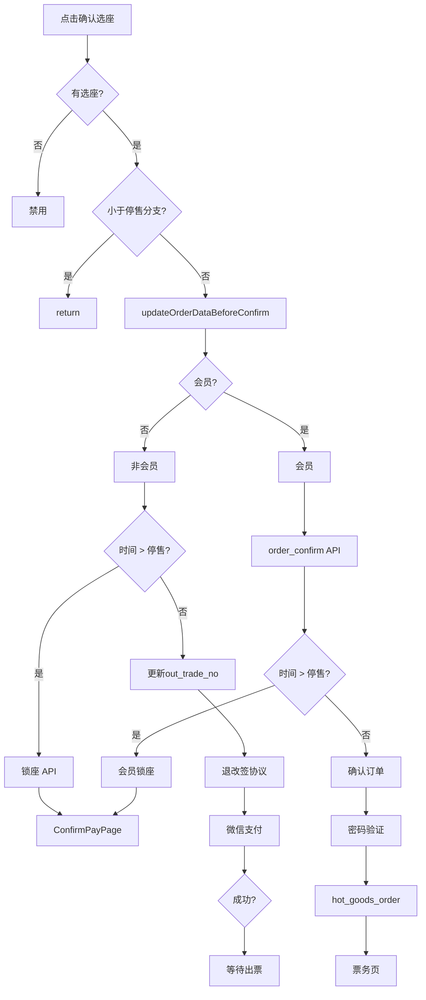

# 「确认选座」按钮 - 逻辑节点清单

本文档列出「确认选座」按钮相关全部节点，便于按节点追踪、调试与对接。

---

## 一、入口节点

| 节点ID | 类型 | 节点名 | 说明 |
|--------|------|--------|------|
| E1 | 入口 | 点击「确认选座」 | 用户点击按钮触发 |
| E2 | 绑定 | bindtap | 绑定 `onConfirm` |

---

## 二、前置判断节点（按钮点击后立即执行）

| 节点ID | 类型 | 条件/判断 | 分支 | 行为 |
|--------|------|-----------|------|------|
| P1 | 判断 | `_selectedSeatIds.length < _requiredSeatCountForConfirm` | true | 按钮禁用，无法点击 |
| P2 | 判断 | `_isInLessThanThirdPartyBranch == true` | true | **直接 return**，不执行后续 |
| P3 | 判断 | 同上 | false | 继续 → 调用 `_updateOrderDataBeforeConfirm()` |

---

## 三、`_updateOrderDataBeforeConfirm` 内节点

### 3.1 前置

| 节点ID | 类型 | 条件 | 分支 | 行为 |
|--------|------|------|------|------|
| U1 | 判断 | `_isInLessThanThirdPartyBranch == true` | true | **直接 return** |
| U2 | 功能 | 准备 `_updatedOrderData` | - | 深拷贝或置空 |

### 3.2 订单字段计算

| 节点ID | 类型 | 节点名 | 公式/来源 |
|--------|------|--------|-----------|
| U3 | 逻辑 | num | `selectseatid.length` |
| U4 | 逻辑 | total | 普通：`unit_price * num`；改签：`unit_price * num - 原total + 原refund_amount` |
| U5 | 逻辑 | handling_fees | `3.0 * num` |
| U6 | 逻辑 | service_fee | `原 service_fee * num` |
| U7 | 逻辑 | seat_list | `selectname` |
| U8 | 逻辑 | seat_id | `selectseatid` |

### 3.3 数据库更新

| 节点ID | 类型 | 节点名 | 说明 |
|--------|------|--------|------|
| U9 | 判断 | 订单 id 为空 | 跳过数据库更新 |
| U10 | 接口 | Supabase update | 表 `cinema_order_list`，变更字段 + updated_at |
| U11 | 判断 | 更新后 `_isInLessThanThirdPartyBranch` | true → **return** |

### 3.4 会员/非会员分流

| 节点ID | 类型 | 条件 | 分支 |
|--------|------|------|------|
| U12 | 判断 | `cardInfo == null` | 非会员分支 |
| U13 | 判断 | `cardInfo != null` | 会员分支 |

---

## 四、非会员分支节点

### 4.1 时间判断

| 节点ID | 类型 | 数据来源 | 说明 |
|--------|------|----------|------|
| N1 | 数据 | ruleInfo | `homeProvider.ruleInfo` |
| N2 | 数据 | lock_minute | `ruleInfo['lock_minute']`，默认 60 |
| N3 | 数据 | orderStartTime | `_updatedOrderData['start_time']` |
| N4 | 数据 | minutesDifference | 场次开始时间 − 当前时间（分钟） |
| N5 | 判断 | ruleInfo 为 null | 不进入时间分支 |
| N6 | 判断 | `minutesDifference > lockMinuteValue` | **大于停售** → `_lockSeatForNonMember()` |
| N7 | 判断 | `minutesDifference <= lockMinuteValue` | **小于等于停售** → `_updateOrderOutTradeNo()` + 支付流程 |

### 4.2 非会员锁座 `_lockSeatForNonMember`

| 节点ID | 类型 | 节点名 | 说明 |
|--------|------|--------|------|
| NL1 | 接口 | GET seat_lock | `https://dingxin.meicity.net/api/nonmember/seat_lock` |
| NL2 | 参数 | cid, play_id, seat_id, play_update_time | 需签名 |
| NL3 | 判断 | 成功且 lockFlag 存在 | 写 lock_flag → 更新 DB → push ConfirmPayPage |
| NL4 | 判断 | 成功但无 lockFlag | **对话框**「锁座失败」+「锁座失败，请重新选择座位」 |
| NL5 | 判断 | 接口返回失败 | **对话框**「锁座失败」+ errorMessage |
| NL6 | 异常 | HTTP 非 200 | **SnackBar**「锁定座位失败: ...」 |
| NL7 | 异常 | 解析异常 | **SnackBar**「锁座失败，请重新选择座位」 |

### 4.3 小于等于停售：更新订单号 + 支付（微信小程序简化：直接微信支付）

| 节点ID | 类型 | 节点名 | 说明 |
|--------|------|--------|------|
| NP1 | 功能 | `_updateOrderOutTradeNo()` | 新 out_trade_no: `mcyy-yplj-{订单id}` |
| NP2 | 对话框 | 退改签协议 | TicketRefundChangeAgreementDialog，不同意 → return |
| NP3 | 对话框 | 选择支付方式 | **微信小程序省略**：直接走微信支付 |
| NP4 | 功能 | `_processWeChatPaymentForNonMember` | 见下 |

### 4.4 微信支付 `_processWeChatPaymentForNonMember`

| 节点ID | 类型 | 节点名 | 说明 |
|--------|------|--------|------|
| W1 | 对话框 | 加载 | 「正在处理支付...」 |
| W2 | 接口 | POST 微信统一下单 | `https://pay.meicity.net/wx/v3-unified/cinema` |
| W3 | 参数 | out_trade_no, total（分）, description | Body |
| W4 | 功能 | 调起微信支付 | WeChatPayService / wx.requestPayment |
| W5 | 判断 | 支付 SUCCESS | 关闭加载 → `_showProcessingTicketDialog()` |
| W6 | 判断 | 支付 CANCELLED | 关闭加载 → **SnackBar**「支付已取消」 |
| W7 | 异常 | catch | 关闭加载 → **SnackBar**「支付失败: ...」 |

---

## 五、会员分支节点

### 5.1 更新订单号

| 节点ID | 类型 | 节点名 | 说明 |
|--------|------|--------|------|
| M1 | 逻辑 | 新 out_trade_no | `mcyy-cardgm-{订单id}` |
| M2 | 接口 | Supabase update | 更新 cinema_order_list.out_trade_no |

### 5.2 购买限制检查

| 节点ID | 类型 | 节点名 | 说明 |
|--------|------|--------|------|
| M3 | 接口 | GET order_confirm | `https://dingxin.meicity.net/api/member/order_confirm` |
| M4 | 参数 | cid, card, play_id（可选）, total | 需签名 |
| M5 | 判断 | 返回 null | 跳过检查 |
| M6 | 判断 | canBuy === false | **对话框**「订单确认失败」→ return |
| M7 | 判断 | balanceCheck.canPay === false | **对话框**「余额不足」→ 取消/确认充值 |
| M8 | 判断 | dayBuyInfo.canBuy === false | **对话框**「当日购票限制」→ 解绑卡 |
| M9 | 判断 | showBuyInfo.canBuy === false | **对话框**「当场购票限制」→ 解绑卡 |

### 5.3 会员时间判断

| 节点ID | 类型 | 条件 | 分支 |
|--------|------|------|------|
| M10 | 判断 | `minutesDifference > lockMinuteValue` | **会员锁座** → `_lockSeatForMember()` |
| M11 | 判断 | `minutesDifference <= lockMinuteValue` | **会员小于等于停售** → `_showOrderConfirmDialogForMember()` |

### 5.4 会员锁座 `_lockSeatForMember`

| 节点ID | 类型 | 节点名 | 说明 |
|--------|------|--------|------|
| ML1 | 接口 | POST seat_lock | `https://dingxin.meicity.net/api/member/seat_lock` |
| ML2 | Body | cid, play_id, seat_id, play_update_time, card | JSON，需签名 |
| ML3 | 判断 | 成功且有 lockFlag | 写 lock_flag → 更新 DB → push ConfirmPayPage（onlyMemberCardPayment: true） |
| ML4 | 异常 | 失败 | **SnackBar**「锁座失败: ...」 |

### 5.5 会员小于等于停售：确认订单 + 密码 + 扣费

| 节点ID | 类型 | 节点名 | 说明 |
|--------|------|--------|------|
| MC1 | 对话框 | 确认订单信息 | 影片/场次/座位/金额/卡号，取消/确认 |
| MC2 | 对话框 | 会员卡密码验证 | 密码输入框，取消/确认 |
| MC3 | 接口 | GET card_auth | `https://dingxin.meicity.net/api/member/card_auth` |
| MC4 | 参数 | card, password（MD5） | 需签名 |
| MC5 | 判断 | auth === 1 | 调用 `_processHotGoodsOrderOnly()` |
| MC6 | 异常 | auth 非 1 或解析失败 | **SnackBar**「密码验证失败...」 |

### 5.6 卖品订单扣费 `_processHotGoodsOrderOnly`

| 节点ID | 类型 | 节点名 | 说明 |
|--------|------|--------|------|
| MH1 | 对话框 | 加载 | 「正在处理扣费...」 |
| MH2 | 接口 | POST hot_goods_order | `https://dingxin.meicity.net/api/member/hot_goods_order` |
| MH3 | Body | cid, partner_buy_ticket_id, num, goods_card_balance_pay, mobile, card, delivery_type | JSON，需签名 |
| MH4 | 判断 | 成功 | 关闭加载 → 更新 order_id → 更新支付状态 → **对话框**「扣费成功」 |
| MH5 | 判断 | 失败/返回 null | **SnackBar**「扣费失败，请稍后重试」 |
| MH6 | 异常 | catch | **SnackBar**「扣费失败: ...」 |

---

## 六、对话框节点汇总

| 节点ID | 标题/类型 | 内容 | 按钮/结果 |
|--------|-----------|------|-----------|
| D1 | 退改签协议 | 退改签规定 | 同意/不同意 |
| D2 | 选择支付方式 | 微信/支付宝/券 | **微信小程序省略** |
| D3 | 锁座失败 | errorMessage 或「锁座失败，请重新选择座位」 | 确定 |
| D4 | 正在处理支付 | CircularProgressIndicator | 无 |
| D5 | 等待系统出票 | 出票中，请稍候 | 返回首页 |
| D6 | 订单确认失败 | _message / reasons | 确定 |
| D7 | 余额不足 | 余额与订单金额说明 | 取消、确认充值 |
| D8 | 当日/当场购票限制 | 限制说明 | 取消、确定（解绑卡） |
| D9 | 确认订单信息 | 影片/场次/座位/金额/卡号 | 取消、确认 |
| D10 | 会员卡密码验证 | 密码输入框 + 卡号 | 取消、确认 |
| D11 | 正在验证密码 | CircularProgressIndicator | 无 |
| D12 | 扣费成功 | 扣费成功，等待出票 | 确定（跳转票务页） |

---

## 七、接口节点汇总

| 节点ID | 用途 | 方法 | URL |
|--------|------|------|-----|
| API1 | 非会员锁座 | GET | `https://dingxin.meicity.net/api/nonmember/seat_lock` |
| API2 | 会员锁座 | POST | `https://dingxin.meicity.net/api/member/seat_lock` |
| API3 | 会员购买限制 | GET | `https://dingxin.meicity.net/api/member/order_confirm` |
| API4 | 会员卡密码验证 | GET | `https://dingxin.meicity.net/api/member/card_auth` |
| API5 | 卖品订单（会员扣费） | POST | `https://dingxin.meicity.net/api/member/hot_goods_order` |
| API6 | 微信统一下单 | POST | `https://pay.meicity.net/wx/v3-unified/cinema` |
| API7 | 订单更新/查询 | - | Supabase `cinema_order_list` |

---

## 八、日志/Toast/SnackBar 节点

| 节点ID | 类型 | 文案 | 触发条件 |
|--------|------|------|----------|
| L1 | SnackBar | 支付已取消 | 用户取消微信支付 |
| L2 | SnackBar | 支付失败: ${e} | 支付异常 |
| L3 | SnackBar | 锁定座位失败: ${e} | 锁座 HTTP 非 200 |
| L4 | SnackBar | 锁座失败，请重新选择座位 | 锁座解析异常 / 无 lockFlag |
| L5 | SnackBar | 锁座失败: ${message} | 会员锁座失败 |
| L6 | SnackBar | 密码验证失败... | 会员密码验证失败 |
| L7 | SnackBar | 扣费失败... | 会员扣费失败 |
| L8 | SnackBar | 会员卡解绑成功 | 解绑卡成功 |
| L9 | Toast | 请选择座位 | 未选座点击确认 |
| L10 | Toast | 选座成功 | 订单更新成功（当前简化流程） |

---

## 九、跳转节点

| 节点ID | 目标 | 触发条件 |
|--------|------|----------|
| J1 | ConfirmPayPage | 非会员/会员锁座成功（> 停售） |
| J2 | 等待出票对话框 | 微信支付成功（≤ 停售） |
| J3 | TicketInfoPage | 会员扣费成功后点「确定」 |
| J4 | CardManagePage（充值） | 余额不足点「确认充值」 |
| J5 | 首页 | 返回首页 / 解绑后 |
| J6 | OrderPage | 当前简化流程：Supabase 更新成功后 |

---

## 十、节点流向简图（Mermaid）

---

## 十一、当前微信小程序已打日志的节点

| 日志前缀 | 节点/含义 |
|----------|-----------|
| `[seat-select][L0]` | 加载座位、构建座位网格 |
| `[seat-select][S1]` | toggleSeat 点击，座位信息 |
| `[seat-select][S2]` | 跳过：非座位或过道 |
| `[seat-select][S3]` | 跳过：座位不可选 |
| `[seat-select][S4]` | 当前选定座位状态 |
| `[seat-select][S5]` | 取消选座 |
| `[seat-select][S6]` | 已达上限 |
| `[seat-select][S7]` | 新增选座 |
| `[seat-select][E1]` | 点击确认选座 |
| `[seat-select][P1]` | 判断：未选座 |
| `[seat-select][U3-U8]` | 订单字段计算 |
| `[seat-select][U9]` | 判断：订单 id 为空 |
| `[seat-select][U10]` | 调用/完成 Supabase 更新订单 |
| `[seat-select][J6]` | 跳转 OrderPage |
| `[supabase][API7]` | 更新订单 cinema_order_list（请求/成功/失败） |

---

按上述节点 ID 可在代码中打日志，便于定位问题。例如：`console.log('[N6] minutesDifference=', minutesDifference, 'lockMinuteValue=', lockMinuteValue)`。
